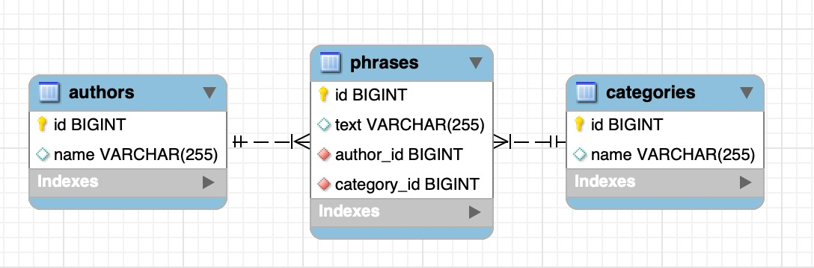

# 📝 Text Generator API

> A RESTful API built with **Java**, **Spring Boot**, and **Maven** to manage authors, categories, and phrases.

### ✨ Features

- 🔧 CRUD operations for Authors, Categories, and Phrases
- 🔗 Entity relationships:
    - An author has many phrases
    - A category has many phrases
    - A phrase belongs to one author and one category
- 🔄 JSON serialization optimized to avoid cycles
- 🗑️ Cascade delete and relationship management

### ⚙️ Stack

  

### 🗄️ Database Design

#### Relationships
- **Author** 1:N **Phrase** (One author has many phrases)
- **Category** 1:N **Phrase** (One category has many phrases)
- **Phrase** N:1 **Author** (One phrase belongs to one author)
- **Phrase** N:1 **Category** (One phrase belongs to one category)

### 🌐 Endpoints

👨‍💼 Authors

| Method | URI             | Action                    | Status Codes             | Body Example |
|--------|-----------------|---------------------------|--------------------------|--------------|
| GET    | /authors        | List all authors          | 200 OK                   | N/A          |
| GET    | /author/{id}    | Get author by ID          | 200 OK, 404 Not Found   | N/A          |
| POST   | /author         | Create author             | 201 Created              | `{ "name": "Gabriel García Márquez" }` |
| PUT    | /author/{id}    | Update author (full)      | 200 OK, 404 Not Found   | `{ "name": "Mario Vargas Llosa" }` |
| DELETE | /author/{id}    | Delete author             | 204 No Content          | N/A          |

🏷️ Categories

| Method | URI               | Action                        | Status Codes             | Body Example |
|--------|-------------------|-------------------------------|--------------------------|--------------|
| GET    | /categories       | List all categories           | 200 OK                   | N/A          |
| GET    | /category/{id}    | Get category by ID            | 200 OK, 404 Not Found   | N/A          |
| POST   | /category         | Create category               | 201 Created              | `{ "name": "Reflection" }` |
| PUT    | /category/{id}    | Update category (full)        | 200 OK, 404 Not Found   | `{ "name": "Philosophy" }` |
| DELETE | /category/{id}    | Delete category               | 204 No Content          | N/A          |

💭 Phrases

| Method | URI             | Action                         | Status Codes             | Body Example |
|--------|-----------------|--------------------------------|--------------------------|--------------|
| GET    | /phrases        | List all phrases               | 200 OK                   | N/A          |
| GET    | /phrase/{id}    | Get phrase by ID               | 200 OK, 404 Not Found   | N/A          |
| POST   | /phrase         | Create phrase                  | 201 Created              | `{ "text": "Life is beautiful", "author": { "id": 1 }, "category": { "id": 2 } }` |
| PATCH  | /phrase/{id}    | Update phrase (partial)        | 200 OK, 404 Not Found   | `{ "text": "New text" }` |
| DELETE | /phrase/{id}    | Delete phrase                  | 204 No Content          | N/A          |

### 📊 HTTP Status Codes Used

#### ✅ Success Codes
- **200 OK** - Successful operation (GET, PUT, PATCH)
- **201 Created** - Resource successfully created (POST)
- **204 No Content** - Successful deletion (DELETE)

#### ❌ Error Codes
- **400 Bad Request** - Invalid data in request
- **404 Not Found** - Resource not found
- **409 Conflict** - Conflict with current state (resource already exists)

#### 📝 Important Notes

- ⚠️ **Cascade Delete**: Deleting authors or categories will also delete their associated phrases
- 🔄 **PATCH Endpoint**: The `PATCH /phrase/{id}` endpoint allows partial updates (only fields sent in the body are updated)
- 🔒 **Cycle Prevention**: JSON serialization is optimized to avoid circular references
- ✅ **Validation**: All endpoints include input data validation

### 📞 Contact

 
